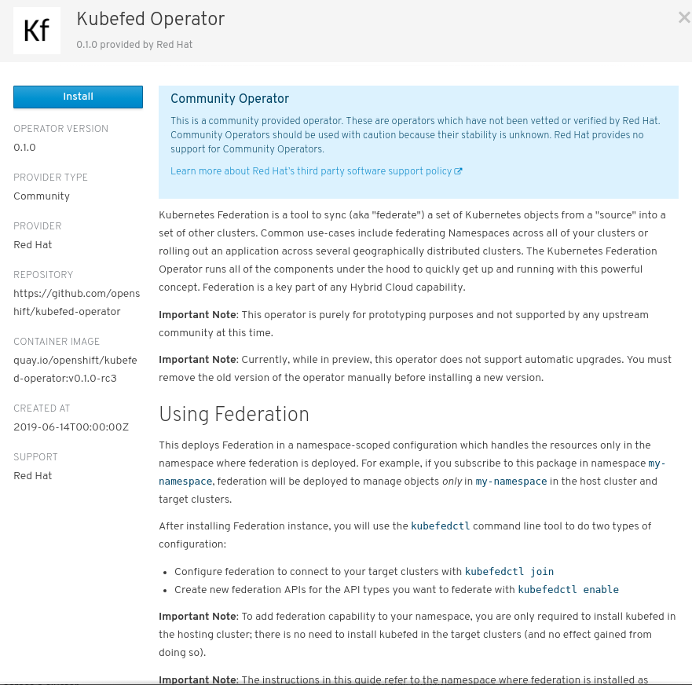

# Federated MongoDB
The files within this directory are used with the Federation V2 operator to show
an application balancing and moving between OpenShift clusters. An accompanying video
is here. This demonstration uses 3 OpenShift 4 clusters. It is assumed that 3 OpenShift
clusters have already been deployed using of the deployment mechanisms defined at
https://cloud.openshift.com.

## Creating a Namespace and Deploying the Operator
The first step is to decide which of the clusters will run the Federation Operator.
Only one cluster runs the federation-controller-manager.

A new project of *pacman* is created within the OpenShift UI. Once the project
is created the Operator should be deployed.

Select OperatorHub 

Once the OperatorHub loads click Federation  

Once Federation has been chosen, information about the Operator will appear. It is
important to take note of the Operator Version as this will be needed when deciding
which version of Kubefed2 to use.

Select Install 

Subscribe to the Federation Operator in the *pacman* namespace by clicking the
*Subscribe* button.

Back at the command line run the following command looking for the status of Succeeded

NOTE: This may take a few minutes

~~~sh
$ oc get csv
NAME                DISPLAY      VERSION   REPLACES   PHASE
federation.v0.0.8   Federation   0.0.8                Succeeded
~~~
## Install the kubefed2 binary

The `kubefed2` tool manages federated cluster registration. Download the
v0.0.8 release and unpack it into a directory in your PATH (the
example uses `$HOME/bin`):

NOTE: This version may change as the operator matures. Verify that the version of
Federation matches the version of `kubefed2`.

~~~sh
curl -LOs https://github.com/kubernetes-sigs/federation-v2/releases/download/v0.0.8/kubefed2.tgz
tar xzf kubefed2.tar.gz -C ~/bin
rm -f kubefed2.tar.gz
~~~

Verify that `kubefed2` is working:
~~~sh
kubefed2 version

kubefed2 version: version.Info{Version:"v0.0.8", GitCommit:"0d12bc3d438b61d9966c79a19f12b01d00d95aae", GitTreeState:"clean", BuildDate:"2019-04-11T04:26:34Z", GoVersion:"go1.11.2", Compiler:"gc", Platform:"linux/amd64"}
~~~

## Joining Clusters
Now that the `kubefed2` binary has been acquired the next step is joining the clusters.
`kubefed2` binary utilizes the contexts and clusters within `kubeconfig` when defining the clusters. Before beginning it is important to setup the `kubeconfig` variable. The steps
below will change the context name and then create a joint `kubeconfig` file.

NOTE: By default the context is defined as *admin* in the `kubeconfig` file for OpenShift
4 clusters.  The directories below east-1, east-2, and east-3 represent the directories
containing the `kubconfig` related to those OpenShift deployments. Your cluster names may be different.
~~~sh
sed -i 's/admin/east1/g' east-1/auth/kubeconfig
sed -i 's/admin/east2/g' east-2/auth/kubeconfig
sed -i 's/admin/west2/g' west-2/auth/kubeconfig
export KUBECONIFG=`pwd/east-1/auth/kubeconfig`:`pwd`/east-2/auth/kubeconfig:`pwd`/west-2/auth/kubeconfig
oc config view --flatten > aws-east1-east2-west2
export KUBECONFIG=`pwd`/aws-east1-east2-west2
~~~

Now that there is a working `kubeconfig` the next step is to federate the clusters using `kubefed2`.
~~~sh
kubefed2 join east1 --host-cluster-context east1 --add-to-registry --v=2 --federation-namespace=pacman --registry-namespace=pacman --limited-scope=true
kubefed2 join east2 --host-cluster-context east1 --add-to-registry --v=2 --federation-namespace=pacman --registry-namespace=pacman --limited-scope=true
kubefed2 join west2 --host-cluster-context east1 --add-to-registry --v=2 --federation-namespace=pacman --registry-namespace=pacman --limited-scope=true

for type in namespaces clusterroles.rbac.authorization.k8s.io deployments.apps ingresses.extensions jobs replicasets.apps secrets serviceaccounts services configmaps clusterrolebindings.rbac.authorization.k8s.io
do
  kubefed2 enable $type --federation-namespace pacman --registry-namespace pacman
done
~~~

Validate that the clusters are defined as `federatedclusters`.
~~~sh
oc get federatedclusters -n pacman
NAME    READY
east1   True
east2   True
west2   True
~~~
