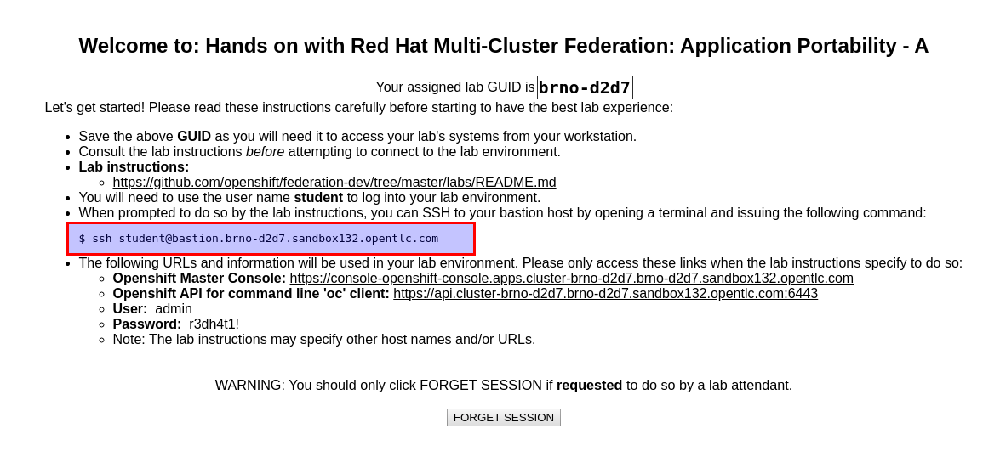

# Introduction and Prerequisites

This hands on lab is a deployment of [Argo CD](https://github.com/argoproj/argo-cd) which will be used to manage multiple OpenShift
clusters. This lab will use the Argo CD above as well as the binary `argocd`.

# Accessing the ClientVM
All of the work will be completed using the ClientVM that you get from GuidGrabber for Cluster1 Environment. Let's go ahead an login into the ClientVM. Remember that login details are presented by GuidGrabber.

e.g:

For *sshing* in the ClientVM you can use your favorite ssh-client.

~~~sh
ssh student@clientvm.GUID.DOMAIN

e.g: ssh student@clientvm.d5fe.sandbox253.opentlc.com
~~~

At this point you should be logged in to the ClientVM and you should have the information for all three environment defined by the GuidGrabber.

During this lab we will utilize the `argocd` binary to define the clusters and repositories in which the Argo CD deployment will manage. 

We will use [cfssl tooling](https://cfssl.org/) when dealing with TLS certificates, `cfssl` and `cfssljson` binaries are already deployed for you.

## Verifications

**All verifications have to be run in ClientVM.**

Verify that [argocd](https://github.com/argoproj/argo-cd/releases/download/v1.1.2/argocd-linux-amd64) is working:

~~~sh
argocd version

argocd: v1.0.2+e0bd546.dirty
  BuildDate: 2019-06-14T17:13:49Z
  GitCommit: e0bd546a07818ec06a27c2b3033454e3eb1c4152
  GitTreeState: dirty
  GoVersion: go1.11.4
  Compiler: gc
  Platform: linux/amd64
argocd-server: v1.1.2+567fcc3.dirty
  BuildDate: 2019-07-30T17:47:02Z
  GitCommit: 567fcc33140ec93051fdf8d0af7ea404deb64f20
  GitTreeState: dirty
  GoVersion: go1.11.4
  Compiler: gc
  Platform: linux/amd64
  Ksonnet Version: 0.13.1
~~~

Verify that [cfssl](https://github.com/cloudflare/cfssl/blob/master/README.md#using-the-command-line-tool) is working:

~~~sh
cfssl version

Version: 1.2.0
Revision: dev
Runtime: go1.6
~~~

Verify that [cfssljson](https://github.com/cloudflare/cfssl/blob/master/README.md#using-the-command-line-tool) is working:

~~~sh
cfssljson -help

Usage of cfssljson:
<OUTPUT OMITTED>
~~~

Verify that the lab content is available on the `ClientVM`:

~~~sh
ls -ld ~/federation-dev/labs
drwxrwxr-x. 3 student users 4096 Aug  1 16:20 /home/student/federation-dev/labs/
~~~

Next Lab: [Lab 2 - Configure OpenShift client context for cluster admin access](./2.md) 
Previous Lab: [Lab 0 - Accessing to the Lab Environment](./intro.md) 
[Home](./README.md)
