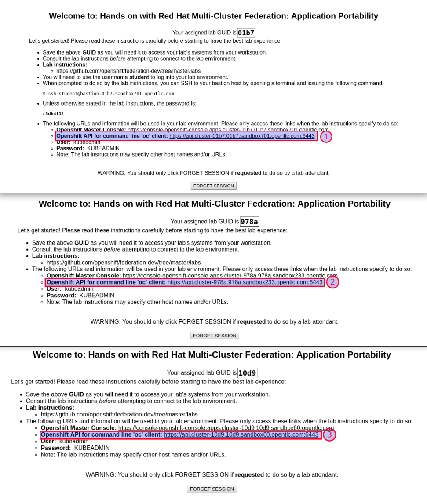

## Configure OpenShift client context for cluster admin access

You should have three environments from GuidGrabber, each environment has a different **OpenShift API for command line 'oc' client** config, make sure you
have three different API Endpoints ready for use. API Endpoints look like: `https://api.cluster-d5fe.d5fe.sandbox253.opentlc.com:6443`

e.g:

Based on the image above, our API endpoints would be:

* A0004-A cluster https://api.cluster-01b7.01b7.sandbox701.opentlc.com:6443
* A0004-B cluster https://api.cluster-978a.978a.sandbox233.opentlc.com:6443
* A0004-C cluster https://api.cluster-10d9.10d9.sandbox60.opentlc.com:6443

> **NOTE:** Below commands refer to GUID and DOMAIN. GUID refers to the environment uniq id assigned by GuidGrabber and DOMAIN refers to the environment dns domain assigned by GuidGrabber. e.g: GUID - `d5fe` DOMAIN - `sandbox253.opentlc.com`

Now, we are going to login into each cluster and rename the context. Make sure you use the correct cluster information for each login step. For example the first login will
be **A0004-A** environment, second login **A0004-B** and third login **A0004-C**.

> **NOTE:** Remember you **have to** use your own environments in commands below, **copy&paste will not work**

~~~sh
# Login into A0004-A cluster
oc login -u admin -p r3dh4t1! --insecure-skip-tls-verify https://api.cluster-GUID.GUID.DOMAIN:6443
oc config rename-context $(oc config current-context) cluster1
# Login into A0004-B cluster
oc login -u admin -p r3dh4t1! --insecure-skip-tls-verify https://api.cluster-GUID.GUID.DOMAIN:6443
oc config rename-context $(oc config current-context) cluster2
# Login into A0004-C cluster
oc login -u admin -p r3dh4t1! --insecure-skip-tls-verify https://api.cluster-GUID.GUID.DOMAIN:6443
oc config rename-context $(oc config current-context) cluster3
~~~

Confirm functionality of the new configured contexts. You will see that as you switch contexts and list nodes, that you are indeed switching to different clusters. Close out this validation by switching back to the `cluster1` context.

~~~sh
oc config use-context cluster1
oc get nodes

oc config use-context cluster2
oc get nodes

oc config use-context cluster3
oc get nodes

oc config use-context cluster1
~~~

After this our current client context is `admin` in `cluster1`.

~~~sh
oc config current-context && oc whoami

cluster1
admin
~~~

The presence and unique naming of the client contexts are important because the `kubefedctl` tool uses them to manage cluster registration, and they are referenced by context name.

Next Lab: [Lab 3 - Deploy Cluster Scoped Federation](./3.md) 
Previous Lab: [Lab 1 - Introduction and Prerequisites](./1.md) 
[Home](./README.md)